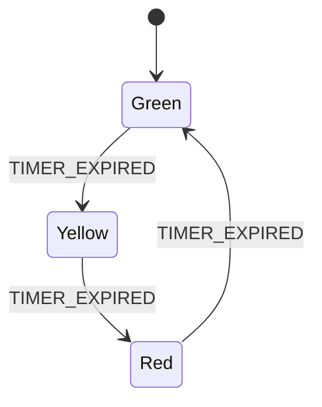

 State Management is a cornerstone of robust software design, and Finite State Machines (FSMs) are one of the most fundamental and powerful patterns for managing it.

Let's break it down from the basics to the fundamentals.

### 1. The Core Problem: Why State Management?

Imagine a simple traffic light. It doesn't randomly show colors; it follows a strict sequence: **Green → Yellow → Red → Green...**

Now, imagine programming this light. A beginner might use a variable like `currentColor` and a bunch of `if` statements:

```javascript
let currentColor = 'green';

function changeLight() {
  if (currentColor === 'green') {
    currentColor = 'yellow';
  } else if (currentColor === 'yellow') {
    currentColor = 'red';
  } else if (currentColor === 'red') {
    currentColor = 'green';
  }
}
```

This seems okay for a traffic light, but what if we add a "walk" signal that must only be on during the "green" light? Or a button for pedestrians to request a crossing? The `if/else` logic quickly becomes complex, brittle, and hard to debug. You can end up with **invalid states** (e.g., the walk signal on while the light is red) because the logic isn't explicit.

**This is the problem state management solves.** It provides a structured way to define:
*   What states a system can be in.
*   How it can transition from one state to another.
*   What actions occur during those transitions.

---

### 2. Finite State Machine (FSM) Fundamentals

An FSM is a mathematical model of computation, but for us, it's a **design pattern** that gives us a precise vocabulary for state management.

An FSM is defined by five key elements:

1.  **A Finite Number of States (S):** The system can only be in one of these states at a time.
    *   *Example: `green`, `yellow`, `red`.*

2.  **An Initial State:** The state the system starts in.
    *   *Example: `green`.*

3.  **A Set of Inputs or Events (E):** These are the triggers that *may* cause a state transition.
    *   *Example: `timer_expired`.*

4.  **Transition Function (T):** This function defines the next state based on the *current state* and an *input/event*. It's the set of rules: "If in state S and event E occurs, move to state S'."
    *   *Example: `(green, timer_expired) -> yellow`.*

5.  **A Set of Outputs or Actions (A):** (Optional but important) What happens when a transition takes place.
    *   *Example: When entering the `red` state, activate the pedestrian walk signal.*

#### Visualizing an FSM: State Transition Diagram

This is the most intuitive way to understand an FSM. It's a graph where:
*   **Circles** represent **States**.
*   **Arrows** represent **Transitions**, labeled with the **Event** that causes them.
*   An arrow pointing to a state from nowhere indicates the **Initial State**.

Here is the traffic light FSM:


#### Key FSM Concepts in Practice

*   **Deterministic:** For a given current state and event, there is exactly one defined next state. You can always predict what will happen.
*   **Finite:** The number of states is limited and known in advance. You can't have an infinite number of states.
*   **Memory:** The current state represents the entire history of the system relevant to its behavior. It's all the "memory" the FSM needs.

---

### 3. Why are FSMs so Powerful? (The Benefits)

Using an FSM pattern makes your code:

1.  **Predictable & Understandable:** The behavior is encapsulated in a clear, visual structure. Anyone can look at a state diagram and understand the system's logic.
2.  **Prevents Invalid States:** By explicitly defining possible states and transitions, it becomes *impossible* for the system to enter an undefined state. There is no transition from `green` to `red`, so it can never happen.
3.  **Easier to Debug:** If something goes wrong, you only need to check:
    *   What state was the system in?
    *   What event occurred?
    The path to the bug is clear.
4.  **Simpler to Implement:** The code becomes a direct translation of the state diagram, often using a `switch` statement or a state transition table (a lookup table mapping `(currentState, event)` to `nextState`).

---

### 4. A Simple Code Example (JavaScript)

Let's implement the traffic light FSM.

```javascript
// 1. Define the possible STATES (as constants)
const STATES = {
  GREEN: 'GREEN',
  YELLOW: 'YELLOW',
  RED: 'RED'
};

// 2. Define the possible EVENTS (as constants)
const EVENTS = {
  TIMER_EXPIRED: 'TIMER_EXPIRED'
};

class TrafficLightFSM {
  constructor() {
    // 3. Set the initial state
    this.currentState = STATES.GREEN;
    this.startTimer(); // Start the timer for the initial state
  }

  // 4. The core transition function
  transition(event) {
    console.log(`Received event: ${event}. Current state: ${this.currentState}`);

    // 5. Define the transition logic
    switch (this.currentState) {
      case STATES.GREEN:
        if (event === EVENTS.TIMER_EXPIRED) {
          this.setState(STATES.YELLOW);
        }
        break;
      case STATES.YELLOW:
        if (event === EVENTS.TIMER_EXPIRED) {
          this.setState(STATES.RED);
        }
        break;
      case STATES.RED:
        if (event === EVENTS.TIMER_EXPIRED) {
          this.setState(STATES.GREEN);
        }
        break;
      default:
        // This should never happen if states are defined correctly!
        throw new Error(`Invalid state: ${this.currentState}`);
    }
  }

  // Helper method to change state and perform actions
  setState(newState) {
    console.log(`Transitioning from ${this.currentState} to ${newState}`);
    this.currentState = newState;

    // 6. Perform actions associated with entering the new state
    // This could be turning on/off lights, starting new timers, etc.
    this.startTimer();
    this.updateLights();
  }

  updateLights() {
    console.log(`>>> ACTIVATING THE ${this.currentState} LIGHT <<<`);
  }

  startTimer() {
    // Simulate a timer. In reality, this would be a setTimeout.
    console.log(`Starting timer for ${this.currentState} state...`);
    // After a simulated delay, trigger the TIMER_EXPIRED event.
    setTimeout(() => {
      this.transition(EVENTS.TIMER_EXPIRED);
    }, 3000); // 3 seconds for simplicity
  }
}

// Usage
const light = new TrafficLightFSM();
// The light will now run automatically based on timers.
// Output:
// Starting timer for GREEN state...
// >>> ACTIVATING THE GREEN LIGHT <<<
// ... (after 3 seconds)
// Received event: TIMER_EXPIRED. Current state: GREEN
// Transitioning from GREEN to YELLOW
// >>> ACTIVATING THE YELLOW LIGHT <<<
// Starting timer for YELLOW state...
```

### 5. Beyond the Basics: Statecharts

Simple FSMs are great, but they can get messy for complex UIs (like a multi-step login form or a video player). **Statecharts** (introduced by David Harel) are an extension of FSMs that add powerful features like:
*   **Hierarchical (Nested) States:** A "Loading" state can have sub-states like "Fetching," "Processing."
*   **Parallel States:** Multiple states can be active at once (e.g., a music player can be "Playing" while the "UI" is in a "MenuOpen" state).
*   **Guards:** Conditions that must be true for a transition to occur (`event` AND `guard`).
*   **Extended State:** Storing context (like a counter or form data) in variables alongside the finite state.

Libraries like **XState** are built on the statechart formalism and are widely used in front-end development.

### Summary

| Concept | Description | Traffic Light Example |
| :--- | :--- | :--- |
| **State** | A distinct mode or status of the system. | `Green`, `Yellow`, `Red` |
| **Event** | A trigger that may cause a state change. | `Timer Expired` |
| **Transition** | The change from one state to another. | `Green --(Timer Expired)--> Yellow` |
| **Action** | A side effect that occurs during a transition. | "Turn on the yellow light." |

**Fundamental Takeaway:** State Management with FSMs is about moving from a tangled web of flags and `if` statements to a **well-defined, explicit, and visual model** of your system's behavior. It's a discipline that leads to more reliable and maintainable code.